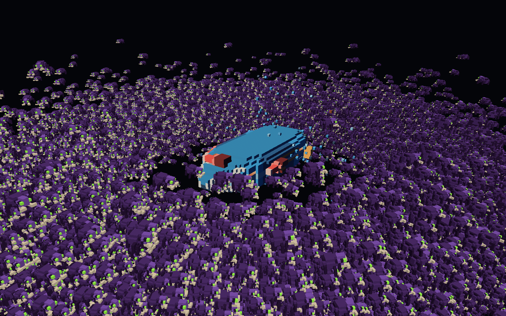
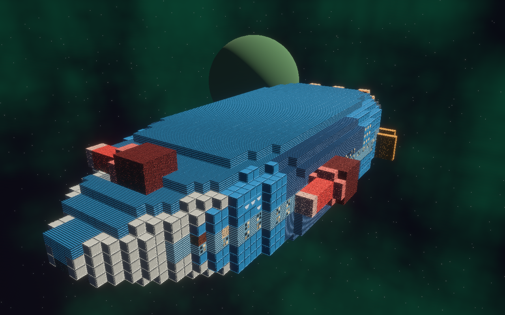
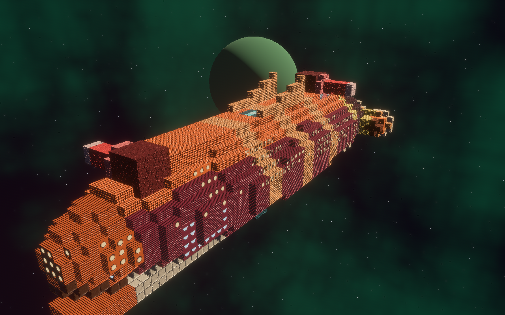
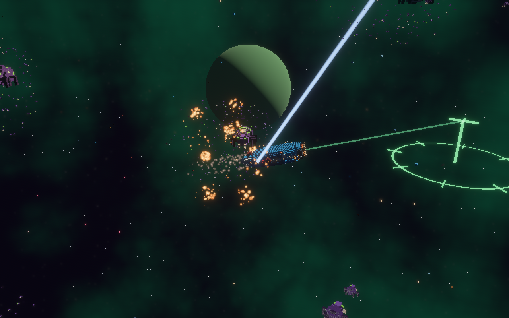
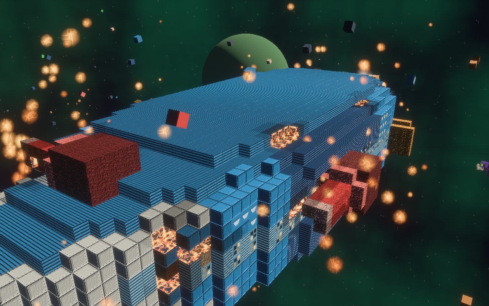
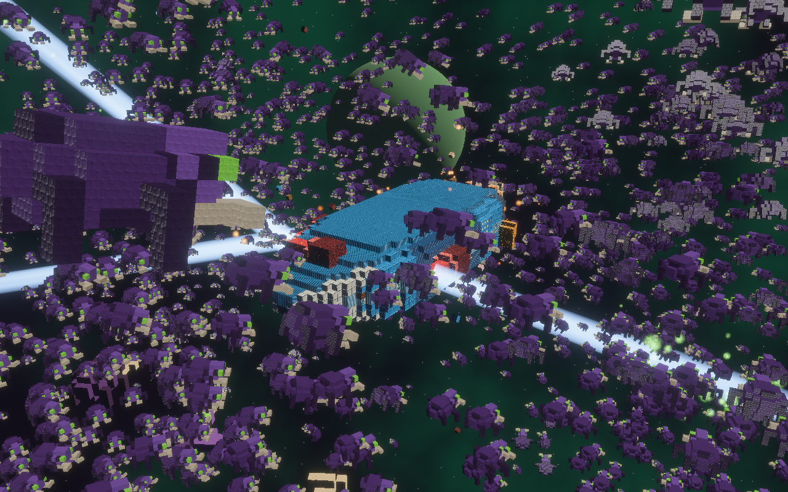
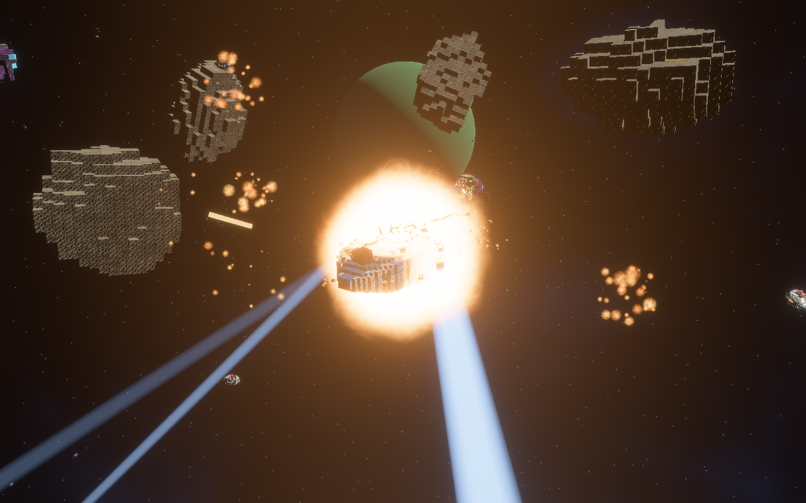

# swarm-demo

A real time space RTS against an alien swarm, in the voxel language of
[redux-tribes](https://github.com/RubenTipparach/redux-tribes). Bevy 0.18.

Right button opens a move order: the cursor picks a point on the plane
through the ship, hold shift to lift it off that plane, release to commit.
Left drag orbits, wheel zooms.

```sh
cargo test -p swarm_core                           # the engine-free core
cargo run --release -p swarm_app                   # a window: drag to orbit, wheel to zoom
cargo run --release -p swarm_app -- --headless \
    --motes 5000 --frames 60 --out shot.png        # no window: render, screenshot, exit
```

## Building and running

One script per shell, the same flags on all three platforms. They check the
toolchain and the platform's own prerequisites before they build, because a
missing alsa header or a missing link.exe fails as a linker error that never
names the package.

```sh
./run.sh                                      # Linux, macOS: build release, open a window
./run.sh --headless -- --motes 5000 --frames 60 --out shot.png
./run.sh --test                               # the suites, then build and run
./run.sh --debug --build-only                 # the dev profile, no run
```

```powershell
.\run.ps1                              # Windows: the same script, the same flags
.\run.ps1 --headless -- --motes 5000 --frames 60 --out shot.png
```

`--triple <target>` cross compiles and does not run. Everything after `--`
goes to `swarm_app` itself, and on Windows, where PowerShell eats the `--`,
the first flag the script does not recognise starts the passthrough anyway.
`run.sh -h` prints the rest. `run.bat` is a plain double-click launcher for
Windows: it just builds the release binary and runs it, no flags.

A built binary is not relocatable yet: `HULLS` and `ASSETS` in
`crates/swarm_app/src/main.rs` are `CARGO_MANIFEST_DIR` paths baked in at
compile time, so it reads its hulls and shaders out of this source tree and
not out of a folder beside itself. Building on each platform is what these
scripts do; shipping one is a change to those two constants.



What is on screen: a stock redux-tribes hull, drawn as redux-tribes draws it
(one material per surface with its finish normal map, windows cut into the
plating wearing their decals), meshed by brick, CPU chewers eating it cell by
cell and throwing chunks, the four alien archetypes in chitin, the swarm
drawn instanced off the buffer a compute pass ticks, and the archive's sky
baked at launch. See `CLAUDE.md` for the design and the rules.




Effects: a hull burning where the swarm has chewed it, guns raking the cloud,
and a reactor going three ticks in.





