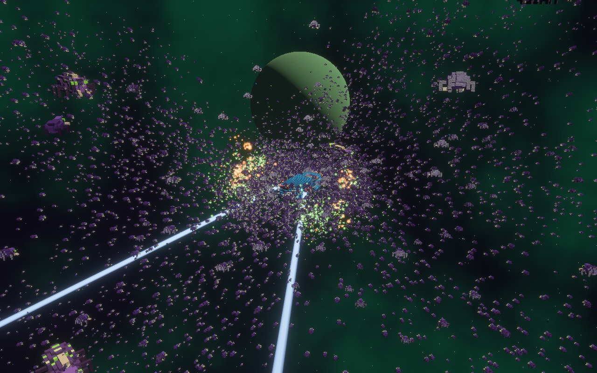
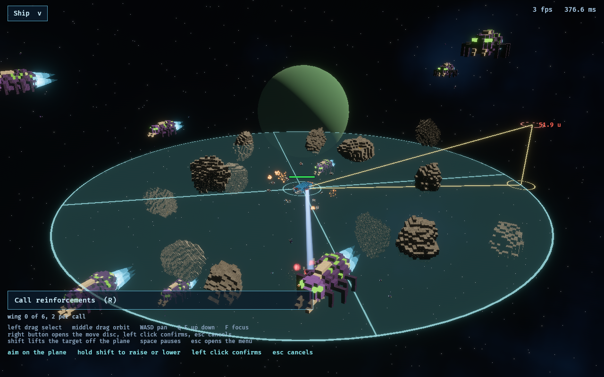
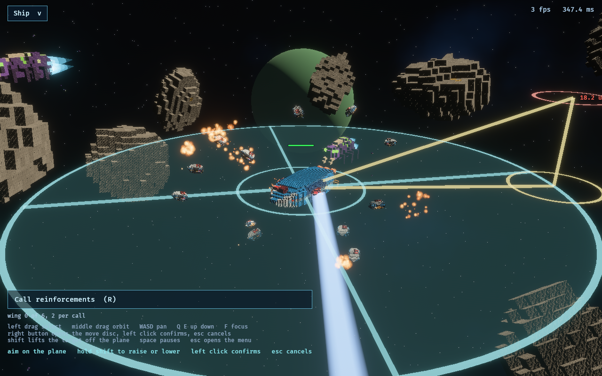
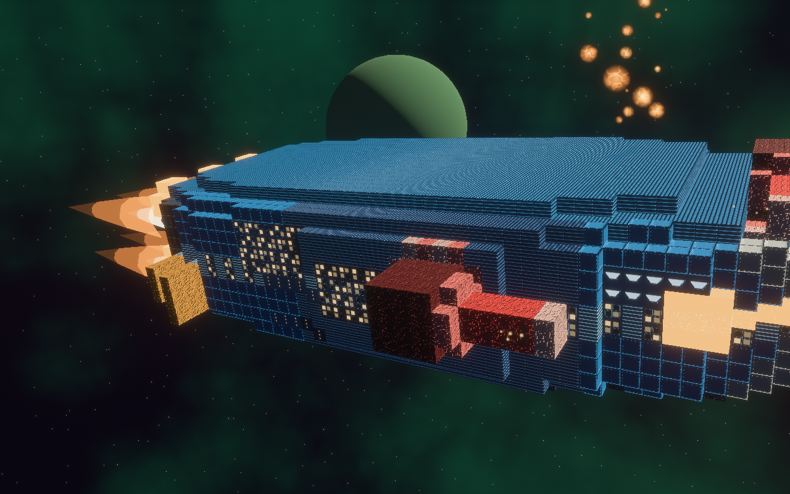
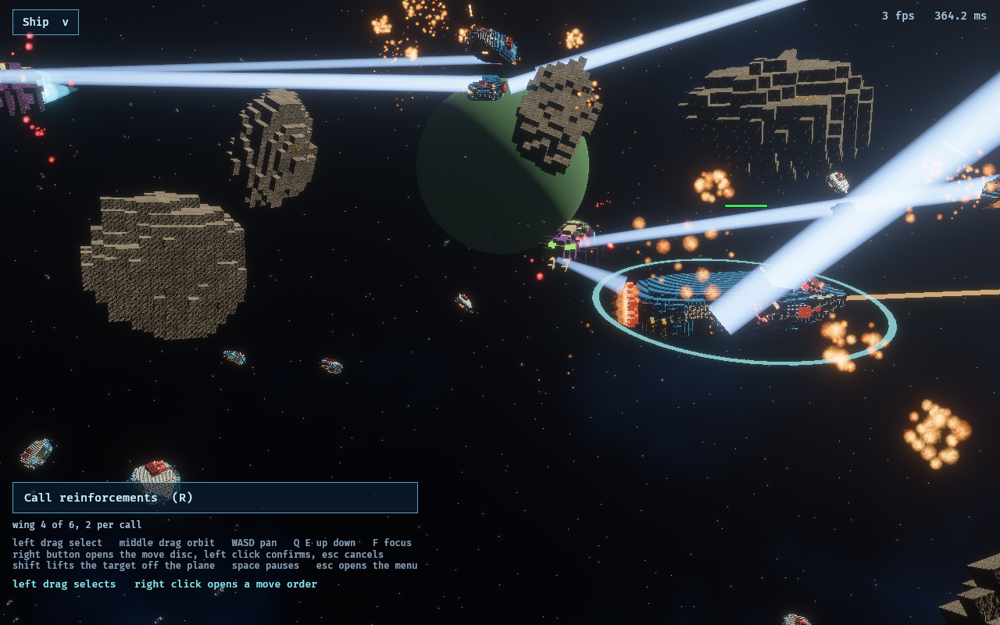
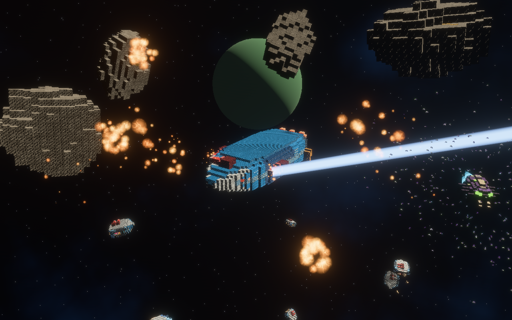
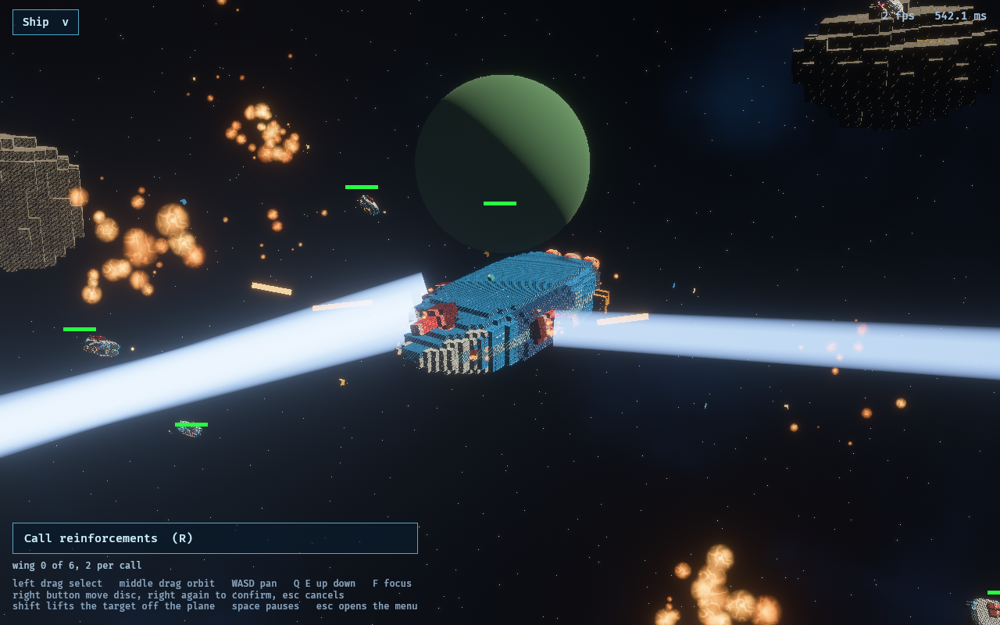
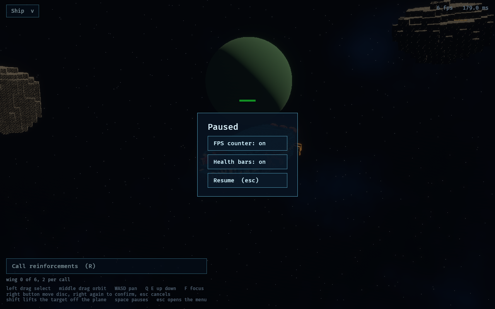

# swarm-demo

A real time space RTS against an alien swarm, in the voxel language of
[redux-tribes](https://github.com/RubenTipparach/redux-tribes). Bevy 0.18.

**Left drag** selects, a click picks one ship, shift adds to the selection. A
selected ship wears a cyan ring and a health bar, and nothing else does.
**Right click** opens the move disc on the selection: the large cyan disc
grows with the cursor so its rim is how far the order goes, the small gold
ring on that rim is where it will go, and holding **shift** lifts that point
off the rim and draws the right angle
triangle back down to it, with the distance in red. **Left click** confirms
(a gold ring pings at the destination and an orange line and ring stand on
each ship until it arrives), **Esc** cancels; Esc again opens the pause menu.
**Space** pauses, and you can still give orders while it is stopped.

**Middle drag** orbits (or alt and left), wheel zooms, **WASD and the arrows**
pan, Q and E lift and drop, **F** snaps the camera to your ship. The ship
dropdown top left swaps your flagship for another class. **R, or the button on screen,
calls in reinforcements**, two per press up to a wing of six, which fly in from
off the map and keep station on you. Your ship also puts up a squadron of
fighters of its own.

Escape opens the pause menu, which carries the frame counter toggle. The
counter is in the top right and shows the frame time beside the rate.

The carriers hold for ten seconds before the first fighter comes out, so there
is a beat before the swarm arrives. `--launch-delay 0` removes it.

```sh
cargo test -p swarm_core                           # the engine-free core
cargo run --release -p swarm_app                   # a window: drag to orbit, wheel to zoom
cargo run --release -p swarm_app -- --fps 60      # frames are capped at 120 by default
cargo run --release -p swarm_app -- --headless \
    --motes 5000 --frames 60 --out shot.png        # no window: render, screenshot, exit
cargo run --release -p swarm_app -- --reinforce 4  # start with a wing already inbound
```

## Building and running

One script per shell, the same flags on all three platforms. They check the
toolchain and the platform's own prerequisites before they build, because a
missing alsa header or a missing link.exe fails as a linker error that never
names the package.

```sh
./run.sh                                      # Linux, macOS: build release, open a window
./run.sh --headless -- --motes 5000 --frames 60 --out shot.png
./run.sh --test                               # the suites, then build and run
./run.sh --debug --build-only                 # the dev profile, no run
```

```powershell
.\run.ps1                              # Windows: the same script, the same flags
.\run.ps1 --headless -- --motes 5000 --frames 60 --out shot.png
```

### If the build seems to hang at the end

It is not hanging, it is LINKING. A Bevy binary is a very large link, and the
last thing cargo prints is the unit it is waiting on:

```
Building [=======================> ] 398/399: swarm_app(bin)
```

That line can sit there for minutes on Windows with no output at all. Task
Manager will show `link.exe` (or `rust-lld.exe`) using a core: that is the
proof it is working rather than stuck.

Three things make it much faster, in the order they are worth doing:

1. **`.cargo/config.toml` already points Windows at `rust-lld`**, the LLVM
   linker that ships with the Rust toolchain. Nothing to install. If it ever
   fails with "linker `rust-lld.exe` not found", delete those two lines and you
   are back to the MSVC linker with everything else working.
2. **Exclude the `target` directory from Windows Defender.** The linker opens
   every object file in the build, and real time scanning inspects each one.
   This is often the single biggest difference on a Windows machine and it
   costs nothing. Settings, Virus and threat protection, Manage settings,
   Exclusions, Add a folder, and pick `swarm-demo\target`.
3. **Do not delete `target` to "start clean".** Every one of those 398 units is
   a dependency that does not change; throwing them away buys nothing and costs
   the whole build again.

`--triple <target>` cross compiles and does not run. Everything after `--`
goes to `swarm_app` itself, and on Windows, where PowerShell eats the `--`,
the first flag the script does not recognise starts the passthrough anyway.
`run.sh -h` prints the rest. `run.bat` is a plain double-click launcher for
Windows: it just builds the release binary and runs it, no flags.

A built binary is not relocatable yet: `HULLS` and `ASSETS` in
`crates/swarm_app/src/main.rs` are `CARGO_MANIFEST_DIR` paths baked in at
compile time, so it reads its hulls and shaders out of this source tree and
not out of a folder beside itself. Building on each platform is what these
scripts do; shipping one is a change to those two constants.


What is on screen: a stock redux-tribes hull, drawn as redux-tribes draws it
(one material per surface with its finish normal map, windows cut into the
plating wearing their decals), meshed by brick, CPU chewers eating it cell by
cell and throwing chunks, the four alien archetypes in chitin, the swarm
drawn instanced off the buffer a compute pass ticks, and the archive's sky
baked at launch. See `CLAUDE.md` for the design and the rules.


Effects: a hull burning where the swarm has chewed it, guns raking the cloud,
a reactor going three ticks in, the engines burning on the throttle they are
actually pulling, and a wing of reinforcements on station.











