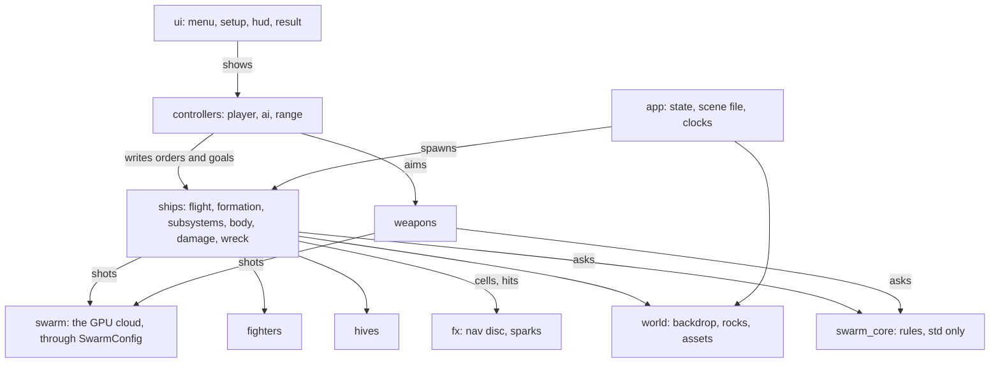

# Menus, a campaign, subsystems, a playground, and a swarm that glows

Status: PROPOSAL. Nothing in here is built. Every section ends with what it
would take and what has to be decided; the build follows the approved list
and nothing else.

The six asks, in the order they were given:

1. A main menu, and a skirmish setup: how many alien motherships against
   which ships on your side.
2. Campaign scenarios, starting with a first encounter that is one ship
   against one carrier and escalating to more swarm.
3. Why do the Karisen ships seem stronger, when they should share the Terran
   frigate's hull values?
4. A playable ship: every subsystem can be destroyed, no engines means no
   moving, no guns means no shooting.
5. Playground missions, starting with freezing the swarm so a beam's carve
   through it can be seen.
6. A damaged swarm creature glows hot yellow and pops when it has had enough:
   explosives and projectiles kill outright, beams wound.
7. A sandbox: shoot a ship with different kinds of gun and watch it tumble,
   and a physics engine, with a recommendation for this kind of voxel game.
8. Clean code, SOLID and readable code as principles of this project: a file
   thousands of lines long is unacceptable, and the rules redux-tribes keeps
   about writing effective code are ported here.

## 0. The code itself, first

This is the section that goes before every other, because every feature
below would land in a file that is already too big to read.

**Measured**, with `tools/shape.py`, which is new and is the check:

| what | today | the limit |
| --- | ---: | ---: |
| `crates/swarm_app/src/main.rs` | 5088 lines, 68 functions | 900 lines a file |
| `crates/swarm_core/src/fx.rs` | 1144 lines | 900 |
| `crates/swarm_app/src/swarm.rs` | 1001 lines | 900 |
| functions over 100 lines | 11: `setup` 466, `build_hud` 238, `go_critical` 233, `mesh_region` 224, `spawn_ship` 180, `main` 145, `nav_input` 135, `prepare_swarm_buffers` 131, `orbit_input` 129, `fly_hull` 114, `reactor_of` 108 | 100 lines a function |
| `rustfmt` | 339 hunks it would change, 167 of them in `main.rs`; the code has never been formatted | zero |
| `clippy` | the core does not pass: one error (`6.283` in `sky.rs` where `TAU` is meant, a lint clippy denies by default) and 7 warnings; the app cannot be linted until the core compiles under clippy | the core clean at `-D warnings`; the app's count never rising |

**The rules**, ported from redux-tribes' `GUIDELINES.md` section 5 and its
`CLAUDE.md`, and adapted to Rust and Bevy. They go into this project's
`CLAUDE.md` in the same change as this document, under "How the code is
written", so they are the project's and not this proposal's.

- **Limits are checks, not promises.** A file under 900 lines, a function
  under 100, `python3 tools/shape.py --check` in the suites, red on any
  regression. The list above is the debt, paid in step 0 below.
- **rustfmt is the format.** `cargo fmt --all -- --check` in the suites. The
  first format is its own commit with nothing else in it, listed in
  `.git-blame-ignore-revs`, so the history stays readable.
- **clippy** clean at `-D warnings` for the core, counted and never rising
  for the app until the split lands, then clean there too.
- **Single responsibility, per module and per system.** A module owns one
  thing and says so in its first line; a system does one thing and is named
  as a verb phrase (`fly_hull`, `draw_nav`); a component is a noun and a
  marker is an adjective. A function that needs a section comment inside it
  (`// ---- the guns ----`) is two functions. `#[allow(clippy::too_many_arguments)]`
  is the smell that says a struct is missing: `spawn_ship` takes thirteen
  arguments and wants a `ShipSpec`.
- **Divergent paths for like functionality are a defect** (GUIDELINES 5.1).
  Where two places need one behaviour they call one function. Found in this
  tree today: the fixed step `dt` is computed by the same three line
  expression in six systems (one `fn step(time, scene)`); the debris cube is
  spawned by the same code in `chew` and `go_critical` (one `throw_chunk`);
  `if hull.dead_hull { continue }` is written in twelve systems, which is the
  ECS's job: a `Dead` marker and `Without<Dead>` on the queries, so a system
  that must not see a wreck cannot. The one duplicate that stays is the
  capsule test in `fx.rs` and `swarm.wgsl`, because the boundary is real, and
  it stays under the rule that the Rust one is the reference and the shader
  is a transcription.
- **Open for extension, closed for modification.** A new weapon is a shot
  kind and one match arm; a new mission is a row; a new class is a file in
  `assets/hulls`. The ship picker reads `manifest.json` rather than a typed
  list. Tuning numbers and scenario contents belong in data files (5.3): a
  Rust table is the first step and `assets/*.ron` is where they go when the
  campaign lands.
- **Liskov.** A wreck is a `Hull` and keeps every invariant a hull has (cells,
  a damage grid, bricks, a heat key), which is why `remesh_dirty` cools its
  burns without knowing. A fighter is not a hull, has no grid, and no query
  pretends otherwise.
- **Interface segregation.** A query names exactly the components it reads,
  and its filters (`Without<Hive>`, `Without<Wreck>`, `Without<Turret>`) ARE
  the interface: they are what lets Bevy prove two systems disjoint.
  Resources stay narrow (`Lead`, `Shots`, `OrderMode`), one fact each.
- **Dependency inversion.** The core depends on nothing but `std`; the app
  depends on the core's public functions and never the other way; a rule has
  one implementation and it is in the core. The test is unchanged: if two
  clients computed this differently, would the match diverge?
- **Rust, specifically.** `f32` wherever state lives; no `HashMap` in
  anything that will be hashed or replayed (the core has none; the app's
  material caches are render side and fine); no `unwrap` past startup, and
  every `expect` says what was assumed; every `pub fn` in the core carries a
  doc comment and a test; a constant lives beside the one system that reads
  it with its unit in the comment; guard every expression at the point it
  can leave its domain; `single()` only where exactly one can exist, which
  the flagship taught; and comments say WHY while the code says what, which
  is the house style and stays.
- **A mockup before a large feature** (GUIDELINES 2), which the move order
  already went through: every screen in this proposal (the menu, the setup,
  the result, the range) is a rendered page linked for approval before it is
  built.
- **Two skills run on every diff before a push**: `/simplify` for reuse and
  altitude, `/code-review` for correctness. No skill in the account covers
  clean code or Rust (searched), so the repository carries its own:
  `.claude/skills/tidy/SKILL.md` runs the shape, the format, the lints, the
  dash grep and the core suite in one command and reports what fails.

**The structure**, in place of one file. In Bevy a Unity class comes apart
into three things: a COMPONENT (its fields), the SYSTEMS that read it (its
methods), and a PLUGIN (the file that registers them). So the unit of
organisation is a folder that is one plugin and one responsibility, a file
that is one thing or one behaviour, and a component that lives in the same
file as the systems that own it. Every function `main.rs` has today is
assigned below.

```
crates/swarm_core/src/          the rules, std only; the boundary is unchanged
  voxel.rs  mesh.rs  damage.rs  rng.rs  alien.rs  rock.rs  sky.rs
  fx/                           fx.rs split: mod.rs (Beam, Blast, the kill tests),
                                sparks.rs, guns.rs (clusters_of and what it derives),
                                reactor.rs, wreck.rs (shatter)
  body.rs                       NEW: mass, centre of mass, inertia, an impulse at a point
  subsystem.rs                  NEW: a cluster's cells and the share of them alive

crates/swarm_app/src/
  main.rs                       arguments, the App, the plugin list, the four sets. Nothing else.
  app/                          the frame
    mod.rs                      AppPlugin: AppState (Menu, Setup, Playing, Result), Tick, FrameLimit
    scene.rs                    SceneSpec: what a scene file says, the CLI's overrides,
                                spawn on OnEnter(Playing), despawn on OnExit
    headless.rs                 Headless, headless_capture, the report
  world/                        the field
    mod.rs                      WorldPlugin
    backdrop.rs                 the half of setup that is scenery: sky, stars, sun, planets, lights
    rocks.rs                    Rock, the asteroids, the SDF list the swarm reads
    assets.rs                   load_textures, sampler, load_hull, surface_materials,
                                window_materials, ChunkMaterials
  ships/                        a hull and what it does: the behaviours
    mod.rs                      ShipsPlugin
    hull.rs                     Hull, Brick, Piece, place_brick, upsert, remesh_dirty, to_mesh
    spec.rs                     ShipSpec (class, armour, chewers, station, seed) and spawn_ship
                                split into spawn_bricks, spawn_turrets, place_chewers
    flight.rs                   fly_hull: the envelope, the rocks, the heading
    formation.rs                Flagship, Escort, Lead, NavTo, publish_hull, apply_nav_to,
                                call_reinforcements, call_one
    subsystems.rs               health per cluster and what offline does to flight and guns
    body.rs                     the rigid body glue: impulses from hits, the tumble, mass from live cells
    damage.rs                   chew, vent_smoke
    wreck.rs                    go_critical split into reactor_blast, throw_dust,
                                spawn_wreck_piece, free_turrets; Wreck, drift_wrecks, Debris, fly_chunks
    turrets.rs                  Turret, aim_turrets
    flames.rs                   FLAME_BANDS, add_flame, draw_flames, throttle_of, glow_engines
  weapons/                      what fires
    mod.rs                      WeaponsPlugin, LiveFx, the shot list handed to the swarm, age_fx
    kinds.rs                    WeaponKind as data: beam, flak, slug, torpedo
    beams.rs                    fire_guns, resolve_beams, draw_beams
    flak.rs                     fire_flak, fly_tracers
  fighters/mod.rs               Fighter, launch, fly, wear, fire
  hives/mod.rs                  Hive, move_hives, publish_hives, bleed_hives
  swarm/                        the GPU swarm: mod.rs (the plugin), buffers.rs, pipeline.rs, extract.rs;
                                prepare_swarm_buffers as one function per buffer
  controllers/                  who gives orders, and never what a ship does with them
    mod.rs                      ControllersPlugin, OrderMode
    selection.rs                Selected, Marquee, select_input
    orders.rs                   NavOrder, nav_input, Pings, Ack
    camera.rs                   Orbit, orbit_input, orbit_camera, ride_the_eye, AtInfinity
    range.rs                    the firing range: pick a weapon, click a cell
    ai/                         escort.rs, fighter.rs, hive.rs: rules that write the SAME
                                orders a player does
  ui/                           every node on screen
    mod.rs                      UiPlugin and the theme: one palette, one table of sizes
    menu.rs  setup.rs  campaign.rs  result.rs
    hud.rs                      build_hud as one function per panel, hud_feedback, hud_orders,
                                tick_fps, pick_hull
    pause.rs                    PauseMenu, toggle_pause
    bars.rs                     draw_bars, draw_marquee, the subsystem pips
  fx/                           what is drawn that is not a thing
    mod.rs                      FxPlugin
    nav.rs                      draw_nav: the disc, the rings, the pings, the ring and line builders
    sparks.rs                   the CPU spark queue

assets/
  hulls/*.ftvx
  scenes/skirmish/*.ron  scenes/campaign/01_first_encounter.ron ... 05_siege.ron
  scenes/playground/freeze.ron  scenes/playground/range.ron
```

Four rules hold it together:

- **Controllers write orders; behaviours execute them.** A controller (the
  mouse in `controllers/orders.rs`, an AI rule in `controllers/ai/`, the
  firing range) writes a `MoveOrder` or a `Goal` onto a ship and never moves
  it; `ships/flight.rs` is the only system that moves a hull. The escort AI
  and the player write the same order type, which is what makes a replay a
  recording of orders, and what lets a controller be swapped (a script, a
  network, a test) without a behaviour knowing.
- **Sets, not one chain.** `main.rs` declares four `SystemSet`s in order:
  `Control` (input and AI), `Simulate` (everything that moves, gated by
  `running`), `Effects` (sparks, wounds, wrecks), `Draw` (ui and fx, never
  gated). Each plugin puts its systems into a set; the thirty line chain in
  `main()` becomes four lines, and a system's place in the frame is a fact
  about the set it is in rather than about the line it was written on.
- **The dependency direction is down and never up.** `ui` depends on
  `controllers` (it shows the mode); `controllers` on `ships` (it writes
  orders onto them); `ships`, `weapons`, `fighters` and `hives` on `world`
  and `app`; `fx` reads everything and writes nothing; `swarm/` is reached
  only through `SwarmConfig`, which is its whole interface; and `swarm_core`
  is under all of it and imports none of it.
- **A scene is a file.** `SceneSpec` is what `assets/scenes/*.ron` deserialises
  to: a name and a briefing, the fleet (a list of `ShipSpec`), the swarm
  (hives, motes, launch delay, standoff), the field (rocks, seed), the rules
  (chewers, armour, the toggles the playground sets), and the mode. The
  command line overrides fields, the setup screen edits one in memory and
  launches it, the campaign is a folder of them in order, and a headless
  render is `--scene assets/scenes/campaign/01_first_encounter.ron`. Levels
  are designed, not random (GUIDELINES 6): the seed is in the file.



**It is proved by the pictures not changing.** The split moves code and
changes no behaviour, so every headless render in the suites is taken
before and after at a fixed step and compared with `tools/pngdiff.py`. Not
byte for byte, or not always: a scene with no kills in it is byte identical
run to run, and a scene with kills is not, because the spark and shock rings
are claimed with atomics and the swarm diverges from the order the threads
arrived in. The acceptance test is the share of pixels that moved, held
against that scene's own floor, and a picture over it is a change that has
to be explained. (Done: see CLAUDE.md, "The app is folders now".)

Cost: a session for the split and the format, its own pull request, before
any feature. Half a day of it is moving functions; the rest is the four
functions over two hundred lines, which do not move so much as come apart.

## 1. The Karisen question, measured first

The rules are identical for every class. A cell's hit points come from what it
is MADE OF (`hp_for`: plate 100, frame 60, casing 50, machinery 40, a glow
cell 30) times `ARMOUR`, which is 1.0 for every player hull; the reactor is
derived the same way on every hull (`reactor_of`, the ball around the most
buried cell) and half of it dead is what kills the ship (`REACTOR_LOSS`); the
chewers on a flagship are `--chewers` (48) whatever its class. Nothing in the
tables says "Karisen".

`cargo run --release -p swarm_core --example hull_stats` reads the answer off
the hulls themselves:

| hull | cells | plate | hit points | guns | engine clusters | reactor cells | plating over the reactor |
| --- | ---: | ---: | ---: | ---: | ---: | ---: | ---: |
| terran_frigate | 8938 | 7085 | 791k | 3 | 8 | 176 | 2 cells |
| karisen_frigate | 7029 | 5366 | 611k | 3 | 6 | 174 | 2 cells |
| terran_destroyer | 9688 | 6818 | 810k | 5 | 6 | 176 | 2 |
| karisen_destroyer | 7312 | 5131 | 612k | 4 | 5 | 177 | 1 |
| terran_cruiser | 11993 | 7901 | 972k | 8 | 6 | 179 | 2 |
| karisen_cruiser | 7876 | 5224 | 641k | 6 | 6 | 176 | 3 |

A Karisen frigate has 21 percent fewer cells and 23 percent less total hit
points than the Terran, the same three guns, and a reactor of the same size
under the same two courses of plating. By the numbers it is the WEAKER ship.
Under an identical chew, headless, both frigates with 120 chewers and no guns
firing:

| hull | chewers | ticks | cells eaten | share of the hull | went critical |
| --- | ---: | ---: | ---: | ---: | --- |
| terran_frigate | 120 | 1500 | 2622 | 29% | no |
| karisen_frigate | 120 | 1500 | 2612 | 37% | no |

The chewers eat the SAME number of cells a tick on either hull (a bite is a
bite), so the smaller ship loses a bigger share of itself in the same time:
the Karisen frigate is a third gone where the Terran is under a third. Neither
reached its reactor in twenty five seconds, which says how long a siege is at
this chew rate and nothing about a difference between the two. If a Karisen
seemed to last longer in play, it was not its hull values.

What a player would feel as "stronger" is not in the tables and is worth
knowing anyway:

- **Where the chewers land.** A chewer stands on a random exposed cell and
  drills straight in. The Terran is a wide flat section, so its reactor sits
  two cells under a deck twelve cells across and a chewer on the deck is over
  the core; the Karisen is a diamond on a keel edge, so most of its skin is
  flank, and a drill from a flank runs the long way to the centreline. Same
  rule, different geometry, and that is the redux-tribes premise (the layout
  IS the damage model) doing exactly what it should.
- **The same 48 chewers on any hull.** A chewer count is per ship rather than
  per cell, so a small hull is eaten faster relative to its size. If a class
  should be worth more chewers, that is the swarm's rule to change, not the
  hull's.
- **A real defect the table exposed.** The reactor is meant to be buried and
  the suite proves it on a synthetic block, but on the stock hulls its
  shallowest cell sits ONE to THREE cells under outside space, and on both
  corvettes it touches it: `reactor_of` measures depth against every empty
  cell including the voids INSIDE a hull between its frame and its parts, so
  "most buried" is buried from a corridor, and the ball around that cell
  reaches the skin. The fix is to measure depth from outside space only (a
  flood fill from the lattice wall, as the mesher's outside test already
  does) and to keep the ball inside a minimum depth; the test then runs on
  the real hulls rather than a block. This is in the build list below because
  it changes how every fight ends.

## 2. Main menu and skirmish setup

*Built: `AppState`, the menu, the setup and the result. CLAUDE.md, "A front
door, a form, a verdict and a sandbox".*

The app boots straight into a fight with whatever the command line said, and
the only way to fight something else is to restart it. That was right for a
harness. A game has a front door.

**States.** `AppState`: `Menu`, `Setup`, `Playing`, `Result`. Bevy's `States`
and `OnEnter` / `OnExit` build and tear down each screen's UI; the fight is
spawned on entering `Playing` from the `Scene` resource, which already IS the
whole specification of a battle (hull, chewers, hives, motes, rocks, fighters,
launch delay). The setup screen writes `Scene`; the command line still writes
it directly, so every headless render works unchanged.

**Main menu**: Campaign, Skirmish, Playground, Quit. The settings the pause
menu already carries (frame counter, bars) stay there.

**Skirmish setup**, one screen, two columns:

| the enemy | your side |
| --- | --- |
| motherships: 1 to 10 (default 3) | flagship: any of the 23 hulls, grouped by navy and rung |
| swarm: small, medium, large (20k, 100k, 300k motes) | wing: 0 to 6 escorts of the flagship's class |
| launch delay: 0 to 20 seconds | fighters: 0 to 24 |
| carriers stand: close, normal, far (`HIVE_NEAR` / `HIVE_FAR`) | |
| the field: asteroids 0 to 30, and a seed | |

Launch spawns exactly what the screen says. Escape from Setup goes back to
the menu.

**A result**, because a win has no screen today: "an empty hive list is the
win condition and needs no rule" is true of the swarm and false of the game.
`Playing` ends when every carrier is a wreck (win) or every player hull is
(loss), wrecks not counting as ships; the `Result` screen says which, how long
it took, and what it cost (ships lost, cells lost). Motes killed would need
one number read back from the GPU once a second: a count, not a position, so
it does not break the rule that nothing about a mote comes back to the CPU. It
is optional and listed as such.

Cost: a session for the states and the two screens, in the HUD's own style,
with the ship list built from `assets/hulls/manifest.json` rather than typed.

## 3. Campaign

Scenarios are DATA, one table in `scenario.rs`: name, a short briefing, the
player's fleet (flagship class, escorts, fighters), motherships, motes, rocks,
launch delay, chewers per ship, how close the carriers stand. Adding a mission
is adding a row. Progress (the furthest mission won) is one small file in the
platform's data directory, so the campaign survives a restart and a rebuild.

| mission | your side | the swarm | the field | what it teaches |
| --- | --- | --- | --- | --- |
| 1. First encounter | one Terran frigate | 1 carrier, 15k motes, 10 s before launch | open space | select, move, and watch the guns work a carrier down |
| 2. Picket | frigate and 2 corvettes | 2 carriers, 40k | 6 rocks | the swarm divides between ships: where you put the escorts decides who gets chewed |
| 3. The rock field | destroyer and 2 frigates | 4 carriers, 100k, veins between the rocks | 14 rocks | rocks are cover and the veins are the swarm's roads |
| 4. Breakthrough | heavy cruiser and a wing of 4 | 6 carriers standing close, 200k | 20 rocks | a siege from inside the ring, reinforcements as a decision |
| 5. Siege | heavy cruiser and a wing of 6 | 10 carriers, 300k, carriers replenish faster | 24 rocks | everything at once |

Escalation is five knobs, not five rules: carriers, motes, chewers per ship,
launch delay, and how close the carriers stand. Every mission gets a headless
render in `docs/` so its picture is proved rather than described.

Cost: half a session for the table, the progress file and the mission select
screen (a list under the Campaign entry, locked past the furthest win); the
missions themselves are tuning, done with the fixed step headless so a
mission's difficulty is a number in a log and not a feeling.

## 4. A playable ship: subsystems that can be destroyed

**What is true today.** Only the reactor matters: half of it dead kills the
ship, and nothing else on a hull does anything when it dies. The turrets are
INVULNERABLE, because their cells are lifted out of the hull's damage grid to
be drawn as children, so a bite that lands on a gun lands on nothing. The
engines plume whatever state they are in.

**The rule to build.** A subsystem is a cluster of cells that already exists,
read off the purposes redux-tribes exported with every cell: each gun cluster
(`gun_clusters`), each drive cluster (`engine_clusters`), the attitude cells
(`purpose::ATTITUDE`), the bridge (`purpose::COMMAND`). Its health is the share
of its cells still alive, and it is OFFLINE below a threshold. This is the
same rule redux-tribes keeps ("a volume is offline before it is gone"), on
the cells this game already has, with one core function
`fx::subsystems_of(model)` and one method `Subsystem::share(damage)` that the
tests pin.

| subsystem | when it is offline | what that does |
| --- | --- | --- |
| a gun | half its cells dead | that turret stops firing and stops aiming (it droops to rest); the others carry on |
| the drives | thrust is the share of live drive cells, so a ship with half its bells gone accelerates at half; at nought it COASTS: no thrust, no braking, a move order is refused with "engines out" | the flames of a dead cluster do not draw |
| the thrusters | turn rate is the share of live attitude cells; at nought the heading is fixed | a ship that can still burn along a heading it cannot change, which is Homeworld's drifting hulk |
| the bridge | half dead: guns fire at half cadence (no fire control) | optional; the cheapest thing that makes the bridge worth protecting |
| the reactor | as now | the ship dies and leaves its wreck |

**The turrets have to be hittable for any of this to matter.** The fix is one
line of intent: a turret's cells stay in the damage grid and are only left out
of the hull's MESH. Bites, beams and blasts then find them as they find any
cell, and the turret child re-meshes from its live cells when its bricks are
dirty, the same way a brick does, so a chewed gun is visibly chewed and a dead
one is a stump. `fire_guns` and `aim_turrets` ask the slot's share.

**Feedback**, or none of it exists for the player: the selected ship's bar
gains four pips (drives, thrusters, guns, reactor) in the bar's three colours,
the mode line says "engines out" when a move order is refused, and a ship that
cannot turn draws its order line from where it will actually go.

Cost: a session. The core half is small and tested; the app half touches
`spawn_ship`, `fly_hull`, `fire_guns`, `aim_turrets`, `draw_flames` and the
bars, each in one place.

## 5. Playground and sandbox

*Built, on the rigid body of section 7: the toggles, the dummy and the range
with all five weapons. The readouts are mass, centre, spin, cells lost and
shots landed; the subsystem states wait on section 4.*

A third menu entry that is a set of toggles on a skirmish rather than a
scenario, and a firing range. Every one of these is a question about the game
that a fight cannot hold still long enough to answer.

### 5a. The toggles

- **Freeze the swarm.** The swarm's own clock already stops when the game
  pauses, and the compute pass still runs with a step of nought, so a frozen
  cloud that still dies to shots is `SwarmConfig.paused` without the CPU's
  pause: the ships fly, the guns fire, and the carve a beam cuts stays cut
  where a player can look at it. One catch to fix on the way: the tick decays
  a mote's speed by 0.985 every pass whatever the step is, so a cloud frozen
  for ten seconds restarts at a crawl; the decay has to be raised to the step.
- **A target dummy**: a hull that never moves and never fires, to shoot at.
- **Slow motion**: a time scale of a quarter on the swarm and the ships alike
  (one number, since they share `STEP_CLAMP`).
- **A blast at the cursor**: a debug shot with a key, to see what a flak burst
  does to a frozen cloud from any angle.
- **An invulnerable flagship**, to watch the swarm at work without the fight
  ending.
- **Any hull, any fleet**: the skirmish setup's own controls.

### 5b. The firing range

A target hull of any class hangs in the middle of an empty field, and the
player is the gun. Pick a weapon, click a cell on the hull, and the shot lands
THERE: the damage it does and the shove it gives are both read off the hit.

| weapon | what it does to the cells | what it does to the ship |
| --- | --- | --- |
| beam | the ring of bites a beam already takes, held while the button is down | a steady push, small, along the beam |
| flak | a blast of cells at the point, as a burst already does to a carrier | a kick outward from the burst |
| slug | NEW: a kinetic round; one deep crater, a column of cells along its line | the hardest kick of the four, along its own line, at the point it hit |
| torpedo | NEW: slow, visible in flight, a big blast on arrival | a wide shove and a spin if it lands off centre |
| the swarm's bite | what a chewer does, one cell at a time, at the point | nothing: a mote has no mass to speak of |

The click is a ray into the hull's own cells (`nearest_exposed` from where the
ray meets the plating), the same place a chewer's bite lands, so the range
tests exactly the damage path a fight uses. The ship TUMBLES: every hit is an
impulse at a point, and a point off the centre of mass turns the ship as well
as shoving it. That is the rigid body of section 7, and it is the whole reason
the range exists: a slug into a frigate's bow should swing the bow away and
leave the ship drifting nose down, and a torpedo under the keel should roll it.
Readouts on screen: mass, where the centre of mass is (it MOVES as cells come
off), spin in degrees a second, cells lost, and each subsystem's state from
section 4. R resets the target. The ship's own guns can be turned on the dummy
too, to watch a turret's fire from outside.

Cost: small for the range itself (a mode, a weapon picker, a ray and the
readouts) once the rigid body exists; the slug and the torpedo are two new
shot kinds on the shot list, one blast each, and a torpedo is a tracer that
takes longer.

Cost of the toggles: small. Freeze and slow motion are two flags the config
already nearly has; the dummy and the debug shot are a spawn and a key.

## 6. The swarm glows hot, then pops

**What is true today.** Any shot takes `SHOT_BITE` (0.6) off a mote; two hits
kill; under half it breaks off for its carrier and repairs. There is no
difference between a beam and a burst, and a wounded mote looks exactly like a
whole one.

**The rule.** Two kinds of harm, which the shot list already distinguishes by
shape (a beam is a capsule with length, a blast is one without):

- **Blasts kill outright.** Flak, the fighters' guns, a reactor's wave: a mote
  inside one is gone that tick. Explosives and projectiles kill.
- **Beams wound.** A mote inside a beam takes `BEAM_BITE` (0.25 proposed) per
  TICK it is inside, so a mote the sweep crosses is hurt and one that dives
  through the beam is hurt more, and a mote that stays in it for four ticks
  pops. A wounded mote still breaks off for home under half, glowing all the
  way, and cools as it repairs at the carrier.
- **The glow.** Hit points already ride in the mote's `extra.x` and already
  reach the draw as an instance attribute, so the change is in `mote.wgsl`
  alone: the body colour mixes toward a hot yellow by `(1 - hp)` squared, over
  the bloom threshold below about 0.4, so a hurt mote reads as an ember from
  across the field. The drive glow is untouched.
- **The pop** is the death burst that exists: the sparks, the debris and the
  shock wave the neighbours feel.

The kill test lives in `fx.rs` first and the WGSL transcribes it, as now; the
one new core test is the rule itself: a blast kills a live mote in one tick and
a beam takes four.

Cost: small. A dozen lines in the shader and the reference, one test, and a
headless render with the swarm frozen to prove the carve, which is what the
playground's freeze is for.

## 7. Physics: the tumble, the contacts, and which engine

*The tumble is built, in the core (`body.rs`), as proposed below. The engine
adoption waits on rich contacts.*

**What this game needs from physics, honestly.** Dozens of rigid bodies (the
ships, the wrecks, the rocks), not thousands: the swarm is a field on the GPU
and is never a body. Impulses from shots, so a hit turns a ship. Contacts that
are RARE: a ship brushing a rock, a wreck section drifting into another, debris
bouncing off plating. No joints, no ragdolls, no stacking. And a simulation
that can be made deterministic and hashed, because the plan for the
authoritative swarm is a coarse continuum on the CPU and lockstep on top of it,
and a physics step that differs in the last bit between two machines is a
desync with no message on it. redux-tribes measured Rapier against exactly
that requirement (ADR-16) and kept forty lines of sphere separation instead,
and its reasons still hold here for the CONTACTS. They do not hold for the
tumble, which needs no contact at all.

**The tumble is the core's, and it is small.** A voxel hull hands over its
mass and its inertia tensor for nothing: every live cell is a point mass at
its centre, so the mass, the centre of mass and the tensor are three sums over
the cells, recomputed from the live cells when bricks go dirty, which is what
makes a ship with its bow shot off spin differently from a whole one. An
impulse at a point is `dv = j / m` and `dw = I_inv (r x j)`, the orientation
integrates the angular velocity, a little damping stands in for the attitude
thrusters fighting the spin (and none at all when the thrusters are dead, from
section 4). About a hundred and fifty lines in `swarm_core`, `std` only,
pinned by tests a block can answer: a hit through the centre of mass does not
turn it, a hit at the rim turns it about the right axis, momentum is kept,
and the same hits give the same spin on two runs. The wrecks already tumble
this way with a hand picked spin; they would take their spin from the blast
instead.

**Which engine, when contacts come.** All three Rust candidates and the two
others, against what this game is:

| engine | what it is | for this game |
| --- | --- | --- |
| **Avian** (`avian3d`) | Bevy native, ECS first: a body is `RigidBody` and `Collider` components on the entity you already have, forces and impulses are components too, colliders come from Parry. 0.5 is the Bevy 0.18 update, published on its own so Bevy upgrades are never held for features; 0.6 adds a BVH broad phase, faster spatial queries and joint motors; 0.7 is the Bevy 0.19 update. | The best fit. The hull entity gains two components and its transform is driven by the engine; the impulse at a point the range needs is `ExternalImpulse::apply_at_point`; a wreck section is the same entity with the same components. Tracks Bevy minors within weeks. |
| **Rapier** (`bevy_rapier3d`) | The older, more travelled Rust engine, with its Bevy plugin as a wrapper round a context resource rather than pure ECS. 0.33 updates to Bevy 0.18 (March), 0.35 to 0.19 (July); 0.34 added support and examples for Parry's new `Voxels` collider shape, which is a voxel hull as its own collider. Has an `enhanced-determinism` feature for cross platform lockstep. | A close second. The voxel collider is exactly our shape, and determinism is a stated feature; but the changelog's unreleased notes say `enhanced-determinism` currently fails to compile with Bevy (a `glam` feature clash) and is incompatible with its new `simd8`, which is the feature this game would most want. Worth re-checking at adoption. |
| **Jolt** (`jolt-rust`) | The C++ engine under Horizon Forbidden West, with Rust bindings that are an early work in progress over a C shim (`joltc-sys` unsafe and up to date, the safe layer best effort). No Bevy plugin. | Not now. Best raw quality and speed of the five, but a C++ build dependency, an unsafe boundary this project has none of, and no Bevy glue to lean on. |
| **PhysX** (`bevy_mod_physx`) | NVIDIA's engine through Embark's bindings and a community Bevy plugin. | No. Heavier than Jolt in every way that matters here, for a game with dozens of bodies. |
| **Own, in the core** | The tumble above plus sphere on sphere and sphere on rock separation, which `fly_hull` already half does. | What to build FIRST, because the sandbox needs the tumble and nothing else, and because it is deterministic and hashable by construction. It stops being enough the day contacts get rich. |

**The recommendation.** Build the rigid body in the core now: the sandbox
needs it, the wrecks want it, and the future continuum needs it deterministic.
When the contacts get rich (ship on ship, wrecks piling on a rock, debris that
bounces), adopt **Avian**, and measure before adopting exactly as redux-tribes
did: bodies and colliders for the fleet, a collision run twice for bit
identical output, the cost of a step against the frame budget, and how much
state a body carries beyond position and velocity, because that is what has to
be hashed and restored. Rapier is the fallback if Avian's determinism falls
short, once its own determinism flag builds against Bevy again.

**A voxel hull's collider**, in three sizes, cheapest first: the bounding
sphere it has today (wrong at the bow and the flanks, right for a first
contact test); a compound of one box per live brick (a frigate is 128 boxes,
a brick that goes dirty rebuilds its box, and the shape follows the damage);
Parry's `Voxels` shape, one cell at a time, exact and made for this, at the
cost of a bigger rebuild when cells die. The compound of bricks is the one to
start with: it is the same partition the mesher and the damage grid already
keep, so a hole in the picture is a hole in the collider.

Cost: a session for the rigid body and its tests, half a session for the
range on top of it. The engine adoption is its own ADR and its own pull
request, when the contacts ask for it.

## 8. The order to build it in

0. **The split, the format and the checks** (section 0), because everything
   after it lands in `main.rs`, and `main.rs` is five thousand lines.
1. **Subsystems** (section 4) and the **reactor burial fix** (section 1),
   because every scenario is a ship that can be disabled and a swarm that has
   to reach the core.
2. **The rigid body in the core and the firing range** (sections 7 and 5b),
   because a ship that tumbles when hit is what makes the subsystems above
   read, and the range is where every weapon gets tuned.
3. **The swarm's glow and pop** (section 6), small and self contained.
4. **The playground toggles** (section 5a), because the freeze is how the
   swarm changes above are proved.
5. **Menu, skirmish setup and the result screen** (section 2).
6. **The campaign** (section 3), which is data once the screens exist.
7. **A physics engine**, as its own ADR, the day contacts get rich (section
   7).

Each step is a pull request with its headless pictures and the numbers in the
commit message, as the rest of the project is.

## 9. Decisions that are yours

- **The offline threshold**: half a subsystem's cells (proposed), or
  redux-tribes' fifth? Half means a gun keeps firing through a lot of damage;
  a fifth means the first good chew silences it.
- **Should a dead bridge do anything?** Half cadence is proposed. Strike it
  if it is one rule too many.
- **Campaign fleets**: fixed per mission (proposed), or the player picks a
  flagship within the mission's rung?
- **The progress file**: yes (proposed), or keep the campaign stateless?
- **The kill counter readback**: one integer a second from the GPU, for the
  result screen and the playground's readout. Allowed, or not worth the
  exception?
- **Time to critical is what "difficulty" means.** Tune every mission by that
  number, measured headless, rather than by feel. Yes?
- **The engine**: the rigid body in the core now and Avian when contacts get
  rich (proposed), or Avian from the start and the tumble through it?
- **The new guns**: a slug and a torpedo for the range (proposed). Do they
  also go on the ships, as classes that carry `ORDNANCE` cells already could?
- **The limits**: 900 lines a file and 100 a function (proposed). Tighter?
  Bevy systems with the house style's comments run long, and the comments
  are worth more than the limit.
